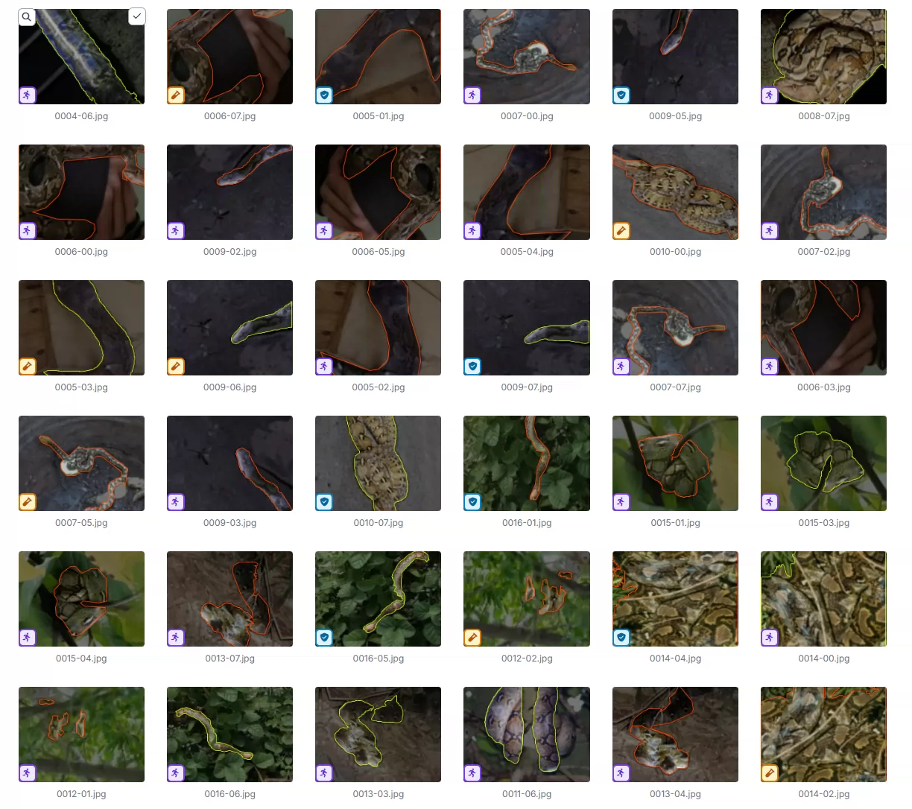
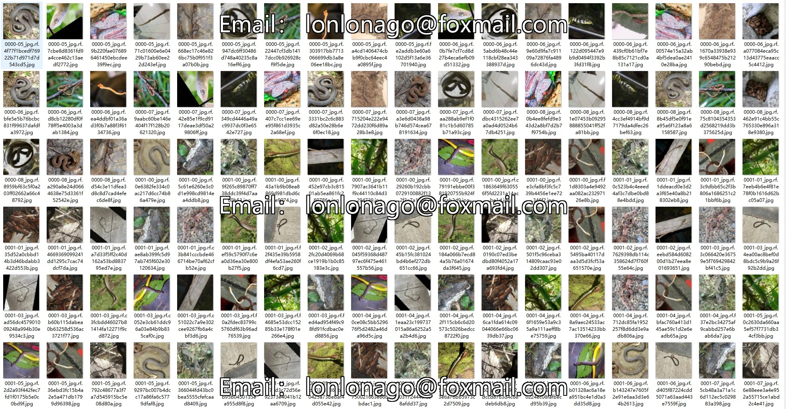
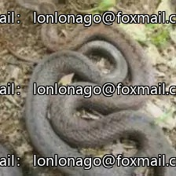
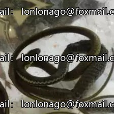
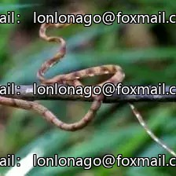
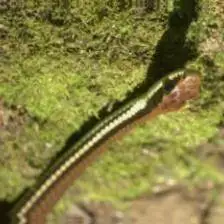

## Body

Snake Species Target Detection Dataset in YOLO format

A total of 9717 images are available, labeled and divided into training set, test set, and validation set.

The dataset is divided into 15 categories: 'mangrove cat snake', 'northern short-headed snake', 'paradise tree snake', 'philippine blunt-headed catsnake', 'philippine bronzeback treesnake', 'philippine cat snake', 'philippine cobra', 'philippine pitviper', 'philippine stripe-lipped', 'philippine whip snake', 'red-tailed green ratsnake', 'reddish rat snake', 'reinhardts lined snake', 'reticulated python', 'smooth-scaled mountain rat snake'.

"Red-tree cat snake", "Northern Short-headed snake", "Paradise tree snake", "Philippine blunt-headed catsnake", "Philippine bronzeback treesnake", "Philippine cat snake", "Philippine cobra", "Philippine pitviper", "Philippine stripe-lipped", "Philippine whip snake", "Red-tailed green ratsnake", "Reddish rat snake", "Reinhardt line snake", "Reticulated python", "Smooth-scaled mountain rat snake".

Electronic virtual products sold without return or exchange.

## Images

Here is a pay link on Stripe ( https://buy.stripe.com/3cs8yP7sY87d0vu9AB ). Please contact me lonlonago@foxmail.com after funding $89, and I will send you a complete data files , thank you!

